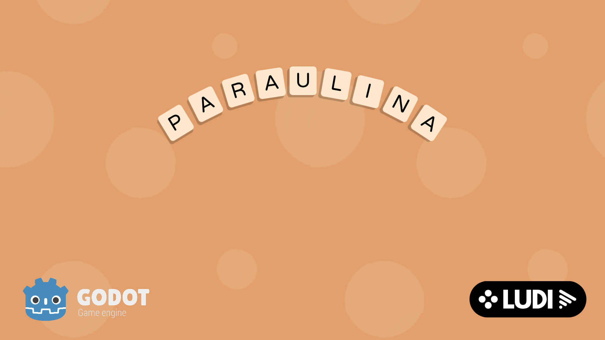

# 🐾 Paraulina  
### Un joc presentat als **Premis Ludi 2025**  
*(https://premisludi.cat/)*

## 🎮 Què és Paraulina?

**Paraulina** és un joc educatiu dissenyat per a l'alumnat de **2n de primària**.  
La teva missió? **Ajudar a trobar animals** escoltant els seus noms i formant-los correctament amb les lletres que alliberis durant la partida.

És una aventura que combina:

- 🎧 **Comprensió oral**
- ✏️ **Ortografia en català**
- 🧩 **Dinàmiques de joc senzilles i divertides**
- 📘 **Una experiència col·leccionista tipus àlbum d'enganxines**

---

## 🚀 Com jugar

L'objectiu és **aprendre vocabulari i ortografia** mentre completes el teu **àlbum d'enganxines**.

1. **Escolta!**  
   En començar, un dictat t'indica els animals que has de trobar.

2. **Trenca!**  
   Fes **dos tocs** sobre els objectes de la pantalla (plomes, pedres, núvols...) per alliberar les lletres que amaguen.

3. **Forma!**  
   Arrossega les lletres a la zona de joc per construir correctament els noms dels animals.

4. **Col·lecciona!**  
   Cada paraula correcta et recompensa amb **enganxines i gomets** per al teu àlbum.

La partida s’acaba quan ja no pots formar més paraules, però **les teves enganxines es guarden per sempre**!

---

## 🕹️ Controls

Controls senzills i accessibles, compatibles amb escriptori i dispositius tàctils:

- **Ratolí / Pantalla tàctil (2 tocs):** Trencar objectes i enganxines.  
- **Arrossegar:** Moure lletres per formar les paraules.

---

## ♿ Accessibilitat

- Inclou la font **OpenDyslexic** per millorar la llegibilitat.  
- Opció **“Mode dislèxia”** al menú, que canvia la font en tot el joc.

---

## 👥 Equip de Desenvolupament

- **Marta Jover Valero**  
- **Alba Silvente Izquierdo**  
- **Mario Dorado Martínez**  
- **Hugo Planell Moreno**

---

## 📦 Versió local del joc

Per jugar a la versió navegador: *(https://mdoradom.itch.io/paraulina)*

